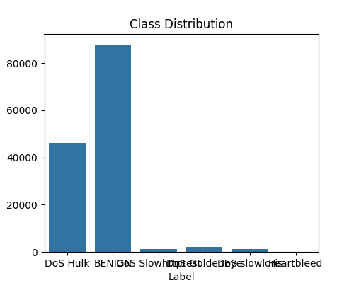
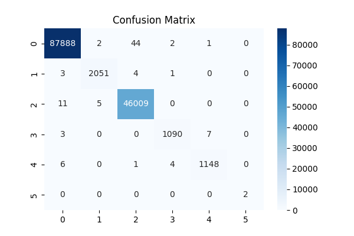
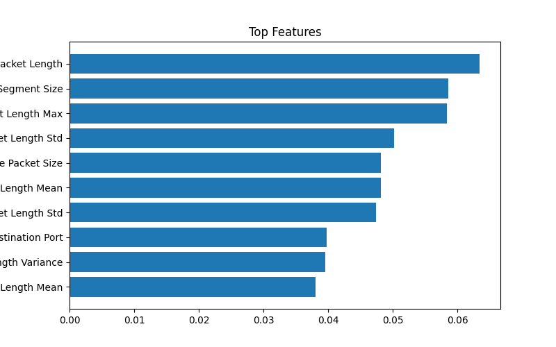

🔐 AI-Powered Cybersecurity Threat Detection System

📌 Project Overview

This project is an AI-powered Cybersecurity Threat Detection System that simulates real-world network security monitoring using Machine Learning.
It detects suspicious network activity, anomalies, and potential cyber attacks using trained ML models on cybersecurity datasets.
This project replicates how real-world Security Operations Centers (SOC) work in companies like:

Google
Microsoft
IBM Security
Palo Alto Networks

🎯 Problem Statement

In modern digital systems, cyber attacks are increasing rapidly.
Security systems must:

Detect malicious activity in real time
Identify unusual network behavior
Reduce false alarms
Respond quickly to threats

This project solves these challenges using Machine Learning-based anomaly detection and classification models.

🌍 Industry Relevance

This system is used in real-world applications such as:

🏦 Banking fraud detection systems
🧠 Enterprise SOC monitoring systems
☁️ Cloud security platforms (AWS, Azure)
🛡️ Cybersecurity threat intelligence systems
📡 Network intrusion detection systems (IDS/IPS)
🚨 Key Features
📊 Cybersecurity dataset-based training
🤖 Machine Learning threat detection (Random Forest / Isolation Forest)
⚡ Real-time prediction API (Flask)
📈 Anomaly detection visualization
🚨 Threat classification (Normal vs Attack)
🧪 Virtual cyber attack simulation
🛠️ Tech Stack
Python 🐍
Pandas / NumPy 📊
Scikit-learn 🤖
Matplotlib / Seaborn 📈
Flask 🌐
Joblib 💾

🏗️ System Architecture
Input Network Data
        ↓
Data Preprocessing
        ↓
Feature Engineering
        ↓
ML Model (Random Forest / Isolation Forest)
        ↓
Threat Prediction Engine
        ↓
Alert Generation System
        ↓
Visualization Output

⚙️ How It Works
Load cybersecurity dataset (NSL-KDD / CICIDS)
Clean and preprocess data
Extract important features
Train ML model on attack patterns
Predict whether activity is normal or malicious
Generate alerts for suspicious behavior
Visualize results using graphs

📁 Folder Structure
AI-Cybersecurity-Threat-Detection/
│
├── data/
│   └── dataset.csv
│
├── src/
│   ├── preprocess.py
│   ├── train.py
│   ├── predict.py
│   ├── visualization.py
│ 
├── models/
│   └── cyber_model.pkl
│
├── outputs/
│   ├── confusion_matrix.png
│   ├── class_distribution.png
│   ├── feature_importance.png
│
├── app.py
├── main.py
├── requirements.txt
├── README.md
└── .gitignore

⚙️ Installation
Step 1: Clone Repository
git clone https://github.com/Amiya-Krishna/AI-Cybersecurity-Threat-Detection.git
cd AI-Cybersecurity-Threat-Detection
Step 2: Create Virtual Environment
python -m venv venv
Step 3: Activate Environment

Windows:
venv\Scripts\activate

Mac/Linux:
source venv/bin/activate

Step 4: Install Dependencies
pip install -r requirements.txt

▶️ How to Run
Step 1: Train Model
python src/train.py
Step 2: Run API Server
python app.py
Step 3: Test Prediction

📊 Output Example
Threat_Detected: True

🧪 Simulation Workflow

Step 1: Load dataset
Step 2: Simulate network traffic
Step 3: Inject attack patterns (DoS, brute force, anomalies)
Step 4: Model analyzes behavior
Step 5: Detects suspicious activity
Step 6: Generates alert
Step 7: Visualizes results

📈 Results
High accuracy threat classification
Effective anomaly detection
Real-time prediction capability
Clean visualization of attack patterns

📸 Screenshots

### 🟢 class_distribution

### 🟢 Class Distribution

### 🚀 Confusion Matrix

### 📈 Feature Importance

🟢 Confusion Matrix
📊 Model Performance Graph
🚨 Anomaly Detection Plot
⚡ API Response Output

🚀 Future Improvements
Real-time packet streaming (Kafka)
Deep Learning-based detection (LSTM/GRU)
SIEM integration
Cloud deployment (AWS / GCP)
Live dashboard using Streamlit

📚 Learning Outcomes
Cybersecurity fundamentals
Machine Learning classification
Anomaly detection techniques
API development using Flask
Real-world SOC simulation

💼 Resume Description
Developed an AI-based Cybersecurity Threat Detection System using Machine Learning to detect malicious network activity and anomalies. Implemented classification and anomaly detection models with real-time Flask API deployment.

👨‍💻 Author

Amiya Krishna Chaurasiya
GitHub: https://github.com/Amiya-Krishna
LinkedIn: www.linkedin.com/in/amiya-krishna-c-7047b4328

⭐ Support

If you like this project:

⭐ Star the repository
🍴 Fork it
🤝 Contribute
=======
# AI-Cybersecurity-Threat-Detection
AI-powered Cybersecurity Threat Detection System using Machine Learning for detecting network intrusions and anomalies.